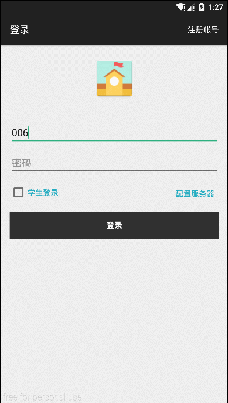
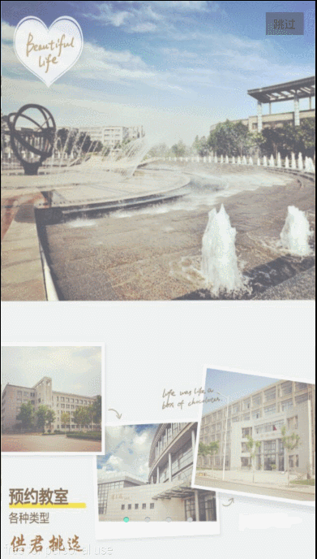

## 毕业设计 -- 教室预约系统

  

## 校园用户预约功能
1. 学生登录/注册
2. 二维码扫描查看网页
3. 快递查询 （接口来自快递100）
4. 教室预约
5. 预约查看
6. 意见发布查看公告
7. 个人资料更改，密码更改
8. 首页轮播图和欢迎页面自动跳转
9. 直接看图吧。。。

## 管理员功能
1. 管理员审核预约
2. 管理员查看用户意见簿
3. 管理员发布最新公告
4. 以上操作功能都会和用户界面同步 例如发布公告，用户看到的就是最新发布的

> 为保护劳动成果只开源APP源码，后台主要使用 servlet+mysql 不进行开源，

#### 特别感谢项目中开源的第三方库 OKGO,convenientbanner 等

## 联系作者

email : forjrking@sina.com

QQ : 891378434